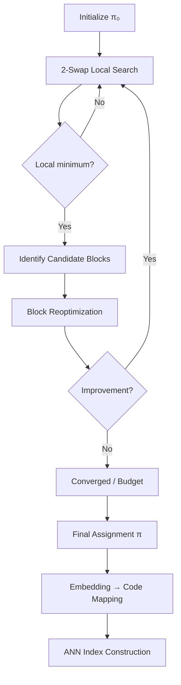

# Gray-Tunneled Hashing: Theory and Research Program

## Overview

Gray-Tunneled Hashing is a novel approach to binary vector encoding that treats the assignment of embeddings to binary codes as an explicit optimization problem. Rather than treating binary code assignment as an afterthought of quantization, this framework models it as a Quadratic Assignment Problem (QAP) with the goal of aligning hypercube geometry (Hamming distance) with semantic geometry (embedding similarity).

## Core Problem

### Binary Vector Search Context

- **Problem**: In large-scale ANN search and vector databases, continuous embeddings are often stored as binary codes
- **Current Practice**: Binary codes are typically assigned via:
  - Simple sign-thresholding
  - Random projections
  - Product quantization where indices happen to be binary
  - Limited control over how Hamming distance relates to semantic similarity

### Key Insight

The assignment of embeddings to hypercube vertices (binary codes) matters critically. If neighboring codevectors are mapped to Hamming-nearby labels, a single bit flip or small channel error results in limited distortion. This was known in classical signal coding but is underutilized in modern large-scale embedding systems.

**Visualizing the Assignment Problem**:

```
Embedding Space (ℝᵈ)          Hypercube Qₙ (Binary Codes)
─────────────────────          ────────────────────────────
    w₁ ●                       000 ── 001
       │                        │     │
    w₂ ● ────── semantic ────── 010 ── 011   Hamming-1 edges
       │   distance              │     │
    w₃ ●                       100 ── 101
       │                        │     │
    w₄ ●                       110 ── 111
       
Goal: Find permutation π such that
  Hamming-1 neighbors ↔ Semantically similar embeddings
```

The challenge is finding the optimal mapping $\pi: \{w_i\} \to V(Q_n)$ where vertices connected by hypercube edges (Hamming distance 1) host embeddings that are semantically close. This creates a Quadratic Assignment Problem where we minimize the cost of "flows" along hypercube edges.

## Theoretical Framework

### 1. Problem Formulation

**Code Space**: The hypercube $Q_n$ with $N = 2^n$ vertices, where each vertex is a binary code in $\{0,1\}^n$.

**Assignment Problem**: Find a permutation $\pi \in S_N$ that maps embeddings $w_1, \dots, w_N$ to hypercube vertices such that:
- Hamming distance between codes correlates with semantic distance between embeddings
- Hamming-1 neighbors correspond to semantically similar embeddings

**QAP Objective**: 
\[
f(\pi) = \sum_{(u,v)\in E} d_{\pi(u)\,\pi(v)}
\]

where:
- $E$ is the set of hypercube edges (pairs of vertices with Hamming distance 1)
- $d_{ij} = \|w_i - w_j\|^2$ is the semantic distance matrix
- The goal is to minimize $f(\pi)$

**Hypercube Structure and Cost Accumulation**:

For a 3D hypercube ($Q_3$), the structure and cost flow looks like:

```
    011 ──── 111
    │  ╲  ╱  │
    │   ╲╱   │
    001 ──── 101
    │   ╱╲   │
    │  ╱  ╲  │
    010 ──── 110
    │  ╲  ╱  │
    │   ╲╱   │
    000 ──── 100

Each edge (u,v) contributes cost d_{π(u)π(v)} to f(π)
Total cost = sum over all 12 edges (for Q₃)
```

The QAP formulation captures the fact that we want embeddings assigned to adjacent vertices (Hamming-1 neighbors) to be semantically similar. Each hypercube edge $(u,v)$ contributes a cost $d_{\pi(u)\,\pi(v)}$ based on the semantic distance between the embeddings assigned to those vertices. The total cost accumulates over all hypercube edges.

This is a Quadratic Assignment Problem (QAP) with:
- **Locations**: Hypercube vertices
- **Facilities**: Embedding indices
- **Flow**: Unit weight on hypercube edges
- **Distances**: Semantic dissimilarity matrix

### 2. Elementary Landscape Theory

**Key Result**: Under 2-swap neighborhood (transpositions of two vertices), the QAP objective defines an **elementary landscape**.

**The 2-Swap Operator**:

A 2-swap transposes the embeddings assigned to two hypercube vertices:

```
Before 2-swap (π):
    ┌─────┐
    │ 000 │ → w₃
    └─────┘
         ╲
          ╲ edge cost: d(w₃, w₇)
           ╲
    ┌─────┐
    │ 001 │ → w₇
    └─────┘

After 2-swap (π' = π ∘ (000,001)):
    ┌─────┐
    │ 000 │ → w₇  (swapped!)
    └─────┘
         ╲
          ╲ edge cost: d(w₇, w₃) = d(w₃, w₇)
           ╲
    ┌─────┐
    │ 001 │ → w₃  (swapped!)
    └─────┘

Note: This particular edge cost stays the same, but other 
edges connected to these vertices change, affecting f(π).
```

The 2-swap neighborhood contains $\binom{N}{2}$ neighbors for each permutation $\pi$. Each swap potentially changes the cost of edges incident to the swapped vertices.

**Theorem**: For the hypercube QAP under 2-swap moves:
\[
\mathbb{E}[f(\pi') \mid \pi] = \left(1 - \frac{4}{N}\right) f(\pi) + \frac{4}{N}\,\bar f
\]

where:
- $\pi'$ is a uniformly random 2-swap neighbor of $\pi$
- $\bar f$ is the global mean of $f$ over all permutations
- $\lambda = 4/N$ is the relaxation rate

**Elementary Landscape Drift**:

The theorem implies that the expected value after a random 2-swap is a weighted average between the current value and the global mean:

```
Expected objective value after 2-swap:

    f(π) ────────┐
                  │
                  ▼
    E[f(π')] = (1-λ)·f(π) + λ·f̄
                  │
                  │  where λ = 4/N
                  │
                  ▼
    ──────────── f̄ (global mean)
    
As N grows, λ = 4/N → 0, so single steps have 
limited pull toward the mean (slow mixing).
```

This drift property is the defining characteristic of an elementary landscape: the neighbor average is an affine function of the current value, creating a predictable global structure.

**Implications**:
- Random walks under 2-swap quickly mix around the global average
- The eigenvalue $\lambda = 4/N$ becomes small as $N$ grows
- Single 2-swap steps have limited pull toward the average
- Large-scale rearrangements require many steps or more powerful moves

**Landscape Structure**:
- $f - \bar f$ is an eigenfunction of the neighbor-averaging operator with eigenvalue $1 - 4/N$
- This provides global structure but doesn't preclude many local minima
- Motivates the need for richer operators (block moves) to escape poor local minima

### 3. Planted Model and Statistical Assumptions

**Ideal Pseudo-Gray Configuration**: A map $\phi: V \to \mathbb{R}^d$ such that:
- If $\|u-v\|_H = 1$ (Hamming-1 neighbors), then $\|\phi(u) - \phi(v)\|$ is small
- If $\|u-v\|_H \ge 2$, distances are typically larger with positive margin

**Pseudo-Gray Arrangement**:

In an ideal pseudo-Gray configuration, embeddings are arranged so that hypercube neighbors correspond to semantically similar points:

```
Embedding Space (semantic geometry)    Hypercube (code geometry)
────────────────────────────────      ────────────────────────
                                       
    φ(000) ●                          000 ── 001
       │   ╱                           │   ╱
       │  ╱ small distance             │  ╱  Hamming-1
       │ ╱  (≤ δ₁)                     │ ╱
    φ(001) ● ──────● φ(011)           001 ── 011
       │           │                    │     │
       │  larger   │                    │     │
       │  distance │                    │     │
       │  (≥ δ₂)   │                    │     │
    φ(010) ●       ● φ(111)           010 ── 111
       │           │                    │     │
       │           │                    │     │
    φ(100) ● ──────● φ(110)           100 ── 110

Key property: Hamming-1 neighbors → small semantic distance
             Hamming-2+ neighbors → larger semantic distance (margin)
```

This creates a smooth embedding of the hypercube where local moves in code space (bit flips) correspond to small moves in semantic space. The planted model assumes such an ideal configuration exists, with observed embeddings being noisy versions: $w_{\pi^*(u)} = \phi(u) + \xi_u$.

**Planted Structure**: There exists a planted permutation $\pi^*$ such that:
\[
w_{\pi^*(u)} = \phi(u) + \xi_u, \qquad u \in V
\]

where $\xi_u$ are independent subgaussian noise vectors with variance proxy $\sigma^2$.

**Margin Conditions**:
- Constants $0 < \delta_1 < \delta_2$ exist such that:
  - Hamming-1 neighbors: $\|\phi(u) - \phi(v)\|^2 \le \delta_1$
  - Hamming-2+ neighbors: $\|\phi(u) - \phi(v)\|^2 \ge \delta_2$
- Noise is small relative to margins: $\sigma^2 \ll \delta_2 - \delta_1$

**Expected Properties**:
- $\pi^*$ should be (almost) globally optimal
- Assignments disagreeing with $\pi^*$ on nontrivial fractions of vertices incur significant cost penalties

### 4. Statistical Tunneling via Block Moves

**Problem**: 2-swap moves alone may get trapped in poor local minima. We need operators that can "tunnel" across barriers.

**Block Moves**: Reoptimize assignments on small subsets of vertices:
1. Choose a block $B \subset V$ with $|B| = k$
2. Let $I_B$ be embeddings currently assigned to vertices in $B$
3. Solve the restricted QAP for reassigning $I_B$ to $B$
4. Apply the reassignment if it improves the global objective

**Block Move Operation**:

A block move reoptimizes the assignment within a small subset of vertices:

```
Before block move on B = {000, 001, 010, 011}:

    ┌─────┐
    │ 000 │ → w₅  ────┐
    └─────┘           │
    ┌─────┐           │ Block B
    │ 001 │ → w₂  ────┤ (2×2 subcube)
    └─────┘           │
    ┌─────┐           │
    │ 010 │ → w₈  ────┘
    └─────┘
    ┌─────┐
    │ 011 │ → w₁
    └─────┘

Solve restricted QAP: reassign {w₅, w₂, w₈, w₁} to {000, 001, 010, 011}
to minimize cost of edges within B and between B and V\B

After block reoptimization:

    ┌─────┐
    │ 000 │ → w₁  (better assignment)
    └─────┘
    ┌─────┐
    │ 001 │ → w₂  (kept)
    └─────┘
    ┌─────┐
    │ 010 │ → w₅  (rearranged)
    └─────┘
    ┌─────┐
    │ 011 │ → w₈  (rearranged)
    └─────┘

This can escape local minima that 2-swap alone cannot reach.
```

**Block Types**:

1. **Geometric subcubes**: Choose subsets forming small subcubes of dimension $m$ ($|B| = 2^m$)

```
Example: 2×2 subcube in Q₃
    ┌─────┬─────┐
    │ 000 │ 001 │ ← Block B
    ├─────┼─────┤
    │ 010 │ 011 │
    └─────┴─────┘
```

2. **Cluster-based**: Partition embeddings into clusters, assign cluster vertices to blocks

```
Embeddings cluster in semantic space:
    Cluster 1: {w₁, w₃, w₇}
    Cluster 2: {w₂, w₄, w₆}
    
Block = vertices assigned to Cluster 1 embeddings
```

3. **Hybrid**: Clusters with geometrically close vertices on hypercube

**Statistical Tunneling Conjecture**:

Under the planted pseudo-Gray model with suitable conditions, there exist constants $\varepsilon > 0$, $c > 0$, and block size $k(N) = O(\log^c N)$ such that:

1. **Near-optimality of block-local minima**: Any assignment $\pi$ that is a local minimum under block moves satisfies:
   \[
   f(\pi) - f(\pi^*) \le \varepsilon N
   \]

2. **Polynomial-time convergence**: A randomized local-search algorithm alternating 2-swap hill-climbing and randomized block reoptimizations reaches near-optimal assignments in polynomial time with high probability.

**Intuition**: Deep bad local minima are rare in typical planted instances once we allow block moves. Any persistent local minimum is near-globally optimal.

**The Tunneling Effect**:

Block moves enable "tunneling" through barriers that trap 2-swap local search:

```
Objective Landscape f(π):

    f(π)
    │
    │     ● Local minimum (traps 2-swap)
    │    ╱╲
    │   ╱  ╲───────────┐
    │  ╱    ╲          │ Barrier
    │ ╱      ╲          │
    │╱        ╲─────────┘
    │          ╲
    │           ╲
    │            ╲
    │             ╲
    │              ● Global minimum (π*)
    │
    └───────────────────────────────────→ Permutation space
    
2-swap path:    ────→ gets stuck at local minimum
Block move path: ────→ tunnels through barrier
```

The key insight is that block moves can simultaneously rearrange multiple vertices, allowing transitions that would require an exponentially long sequence of 2-swaps. In the planted model, if an assignment is far from $\pi^*$, there exists a block that can improve it, preventing deep bad local minima from persisting.

## Algorithmic Framework: Gray-Tunneled Hashing

### Practical Algorithm Sketch

The algorithm alternates between local refinement (2-swap) and global restructuring (block moves):



1. **Initialization**
   - Obtain codebook vectors $c_1, \dots, c_N$ (e.g., via k-means, PQ)
   - Construct initial assignment $\pi_0$:
     - Sort codebooks by principal component, assign in Gray-code order
     - Or use heuristic mapping respecting locality

2. **2-Swap Local Optimization**
   - Run local search applying improving 2-swaps
   - Continue until no improvement or budget reached
   - This refines the assignment but may get trapped

3. **Block Tunneling**
   - Identify candidate blocks (clusters or geometric subcubes)
   - For each block, solve restricted QAP and apply best improving reassignment
   - Iterate between 2-swap local search and block tuning
   - Block moves provide the "tunneling" mechanism to escape local minima

4. **Embedding Assignment and Indexing**
   - Assign codebook indices to binary codes according to optimized $\pi$
   - For each embedding $x$, find nearest codebook vector $c_i$, get binary code via $\pi^{-1}(i)$
   - Store binary codes in Hamming-based ANN index

5. **ANN Queries**
   - For query embedding $q$, compute its code
   - Perform Hamming-distance search
   - Optionally re-rank top candidates using float embeddings

### Expected Benefits

Compared to naive binary coding:
- **Better locality**: Hamming-1 neighbors correspond more consistently to nearest codebooks
- **Higher recall**: Code geometry better aligned with embedding geometry → Hamming balls contain more true neighbors
- **Fewer bits for same quality**: Pseudo-Gray structure may allow shorter codes while maintaining target recall

**Visualizing the Benefit**:

```
Naive Binary Coding:          Gray-Tunneled Hashing:
                               
Query q → Code 011            Query q → Code 011
                               
Hamming-1 neighbors:          Hamming-1 neighbors:
  010 ── 011 ── 111             010 ── 011 ── 111
   │      │      │               │      │      │
   │      │      │               │      │      │
  000 ── 001 ── 101             000 ── 001 ── 101
                               
Neighbors may have            Neighbors are guaranteed
unrelated embeddings          to be semantically similar
                               
Hamming ball around query     Hamming ball contains
contains many false positives  more true neighbors
```

The key improvement is that Hamming distance in code space better reflects semantic distance in embedding space, making Hamming-based search more effective for ANN retrieval.

All achieved without changing underlying Hamming-based infrastructure of vector databases.

## Research and Experimental Program

### Phase I: Synthetic Landscapes

**Goals**:
- Validate theoretical properties on synthetic instances
- Understand landscape structure

**Tasks**:
- Implement synthetic planted QAP instances with known $\pi^*$
- Measure distribution of local minima under 2-swap
- Evaluate effect of block moves on reaching near-$\pi^*$ assignments
- Explore how noise variance and margins affect depth of bad local minima

### Phase II: Real Embeddings and Code Assignment

**Goals**:
- Apply to real-world datasets
- Benchmark against baselines

**Tasks**:
- Use real ANN datasets with precomputed embeddings
- Learn codebooks (k-means, PQ) then optimize code assignment
- Benchmark against:
  - Sign hashing
  - Off-the-shelf binary quantization
  - Random code assignments
- Report metrics: recall@k vs bits vs latency

### Phase III: End-to-End Learning

**Goals**:
- Integrate into learning frameworks
- Evaluate downstream performance

**Tasks**:
- Incorporate pseudo-Gray regularization into autoencoders or VQ-VAE frameworks
- Optimize code assignment during training
- Evaluate downstream performance in retrieval and robustness

## Key Theoretical Questions

1. **Formalize planted model**: Make precise statements about cost gaps and local-minimum structure
2. **Prove tunneling theorem**: Rigorously establish polynomial-time convergence for block operators
3. **Quantify benefits**: Analytically characterize expected improvements in recall/quality
4. **Parameter selection**: Understand optimal block sizes, noise thresholds, and margin conditions

## Implementation Considerations

- **Scalability**: Design efficient algorithms for large $N$ (millions of embeddings)
- **Integration**: Plug into existing binary ANN infrastructure (FAISS, etc.)
- **Hyperparameters**: Tune block sizes, iteration budgets, convergence criteria
- **Parallelization**: Exploit block independence for parallel processing

## Conclusion

Gray-Tunneled Hashing transforms code assignment from a heuristic detail into a controlled combinatorial optimization problem. The framework combines:
- Rigorous QAP formulation
- Elementary landscape structure (explicit eigenvalue $\lambda = 4/N$)
- Planted pseudo-Gray model with statistical guarantees
- Block-move tunneling for escaping local minima

The research program aims to validate the theory and deploy practical algorithms in real vector database settings, with direct implications for large-scale retrieval systems.

